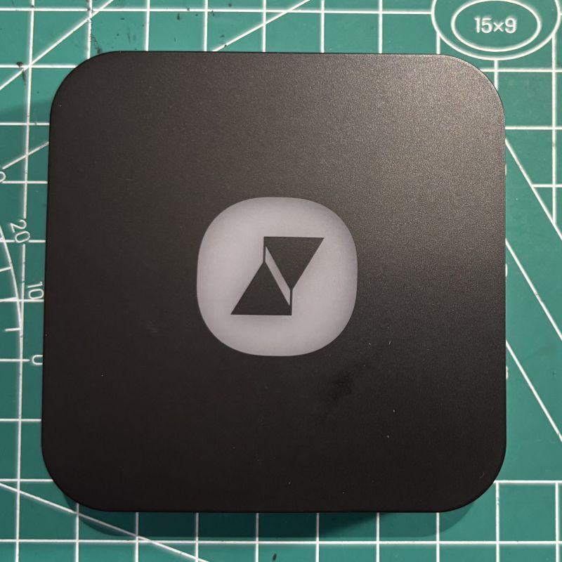
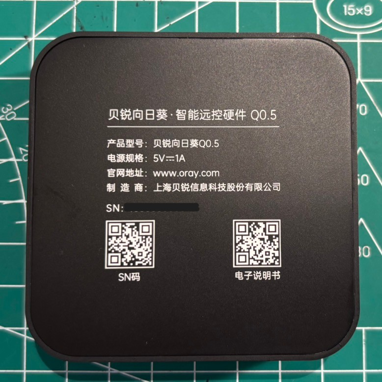
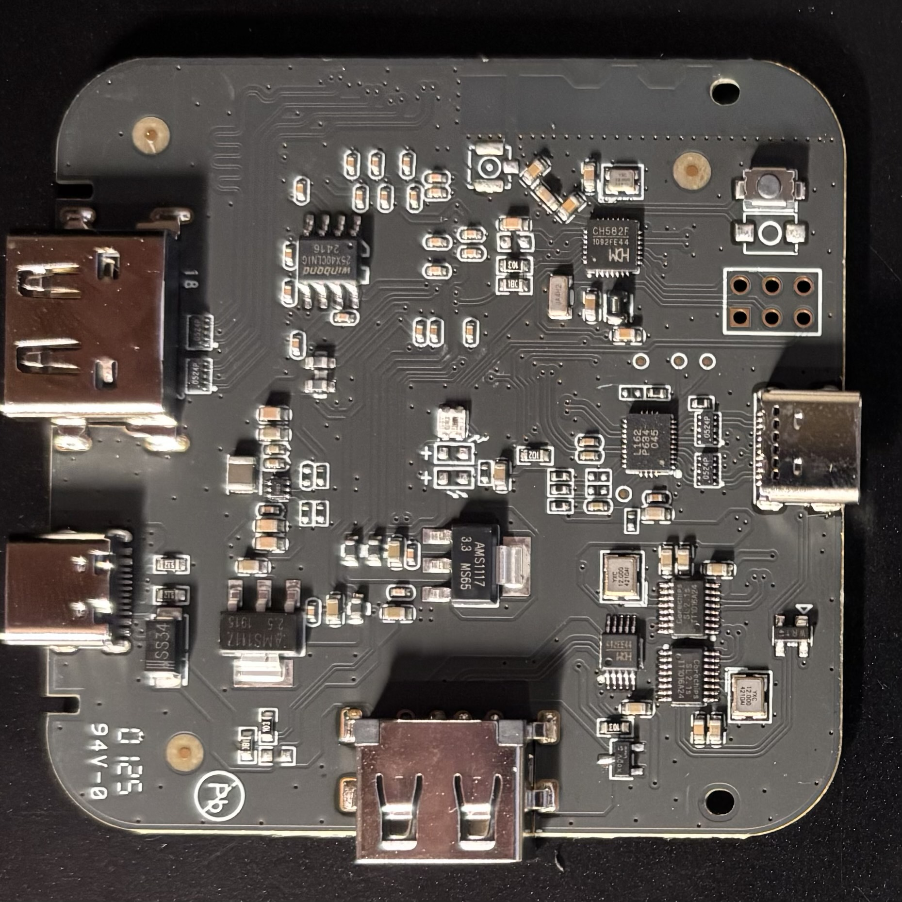
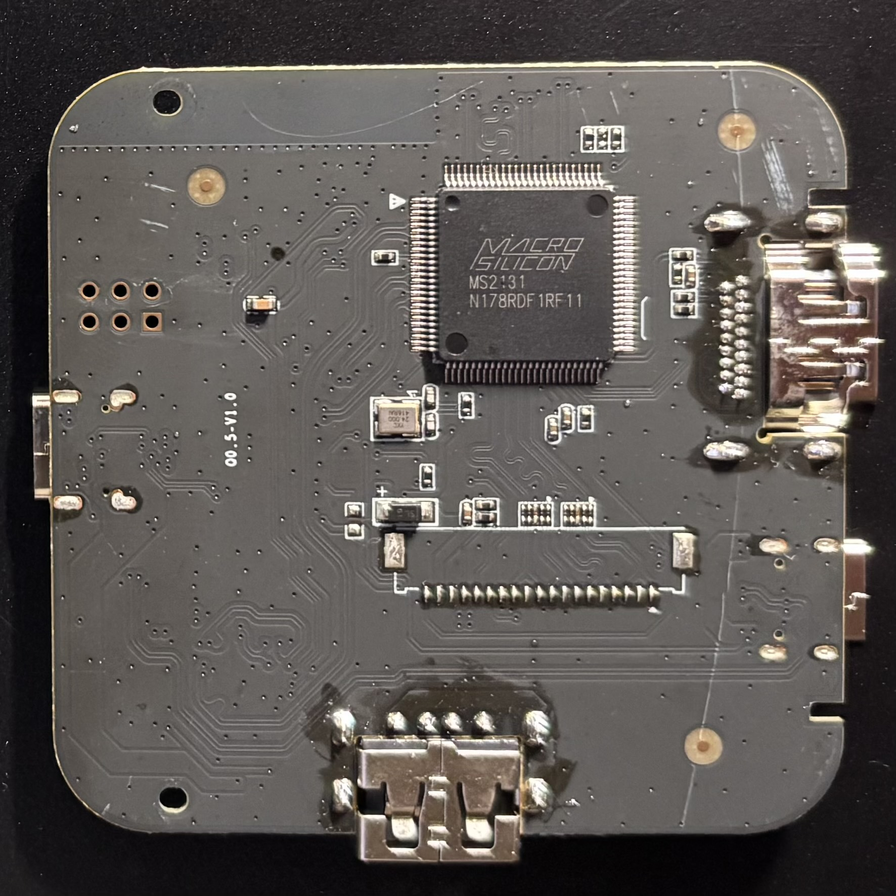

> 由于无法在原作者那边提交commit和issue，我fork了一个备注自己发现的问题和解决办法，供后来者参考。

【已知问题】

5，如果主控机运行了向日葵远程控制软件，那么即使Q0.5刷好了MCU firmware，也会出现一个情况：视频无法调用。

【经过分析后发现MS2131的设备名即使刷过MCU firmware，还是叫Oray Q0.5，接入主控PC后会第一时间被向日葵远程控制软件接管，有两个解决办法
> 1. 提取MS2131固件，重新刷入时改一下设备名称；（我选择了这个方法一劳永逸，刷机软件用[这个](https://github.com/do21/KVM_over_USB_Q05/raw/refs/heads/patch-1/MS21XX&91XXDownloadTool_1.7.0_BUILD20221024.exe.zip)）
> 2. 退出向日葵远程控制软件。】

MS2131固件刷写方法参考下图


@do21

---------------------------------------------------------------------------------------------
# KVM over USB (Q0.5)

⌨️🖥️🖱️

分享一个低门槛的KVM over USB方案

## 简介

[Jackadminx](https://github.com/Jackadminx)/[KVM-Card-Mini](https://github.com/Jackadminx/KVM-Card-Mini) 已经完整了实现KVM over USB
[ElluIFX](https://github.com/ElluIFX)/[KVM-Card-Mini-PySide6](https://github.com/ElluIFX/KVM-Card-Mini-PySide6) 又优化的软件把用户体验提供了一级。
但是 制作硬件的门槛把很多人挡在来门外。

这时候有一个公司发布了一款产品， [贝锐向日葵 Q0.5](https://sunlogin.oray.com/hardware/Q0.5), 一下子把门槛降低了，不用打板，不用焊接，不用打印外壳，甚至在促销的时候价格压到80元以下。
我就把这些东西放在一个，提供给大家一个DIY的思路。

 


## 硬件

向日葵Q0.5产品包含了一个塑料盒子【内有一个块板子】，还有一个双头的USB-C线。用户需要自己准备一根HDMI线和USB-C线。

    

观察这款设备的PCB，除了把MS2109换成了MS2131，其他所用芯片和KVM-Card-Mini HV2.6一样。模拟HID设备的MCU同样使用了CH582F，这样给了一种可能，是不是可以刷 KVM-Card-Mini的固件实现向日葵软件没有的功能，比如抓屏。
    

向日葵Q0.5没有用一颗螺丝，塑料外壳的底板上面有8个卡扣，通过小刀翘一翘，可以慢慢翘开。
 
 
### CH582固件刷入

```diff
- ** 【刷机后不可以恢复向日葵原始固件，不可恢复！不可恢复！不可恢复！】**
```

用MCU公司的工具直接刷。 [下载刷固件工具](https://www.wch.cn/downloads/WCHISPTool_Setup_exe.html) 


一步一步来：

1，打开刷机软件，选择CH58x系列

2，按住pcb上的boot按钮（板子上只有一个按钮），然后“主控usb3.0”这个端口连接到电脑上，上电，松开boot按钮。这是时候刷机软件会自动找到CH582。

3，设备列表自动显示设备型号。

4，目标程序文件1，打开下载的固件 “Firmware.hex”

【最新版本固件，Firmware.hex， https://github.com/ElluIFX/KVM-Card-Mini-PySide6/releases/tag/1.3】

5，点击下载。 右侧下载记录会显示过程，一眨眼功夫就完成了。

（6,两线调试仿真不需要。） 

最后需要reset一下，应用程序里面 重载MCU。

## 软件

刷好CH582F MCU固件之后，可以直接用 [KVM-Card-Mini](https://github.com/Jackadminx/KVM-Card-Mini) 或者 [KVM-Card-Mini-PySide6](https://github.com/ElluIFX/KVM-Card-Mini-PySide6) 发布的client应用程序，当然，[Web应用](https://webclient.0x8991.com/) 也是可以直接用的。

## 已知问题

~~1，原来向日葵的LED灯的设置和逻辑都没有了，刷机后，LED能量，RGB不停换，乱跳~~

【刷了新固件，版本1.3之后LED灯不乱跳了。https://github.com/ElluIFX/KVM-Card-Mini-PySide6/releases/tag/1.3 】

2，键盘不能输入ctrl+alt+del，可以在菜单里面选择自定义快捷键。可以保存下来。快捷键中原有的ctrl+alt+del不能用

~~3，相对鼠标模式 不能用~~
【刷了新固件，版本1.3之后问题解决了】

4，在连接软件之后，我的键盘caps lock灯不受控了，但功能正常

## 感谢

感谢 [Jackadminx](https://github.com/Jackadminx) 和 [ElluIFX](https://github.com/ElluIFX)，希望可以继续优化设计，改进应用。

当然，也感谢贝锐把设计商业化，提供高质量的产品，也希望在后面产品迭代的时，不要隔离原有项目，这样，用我们这些用户可以有一定的可玩空间。
